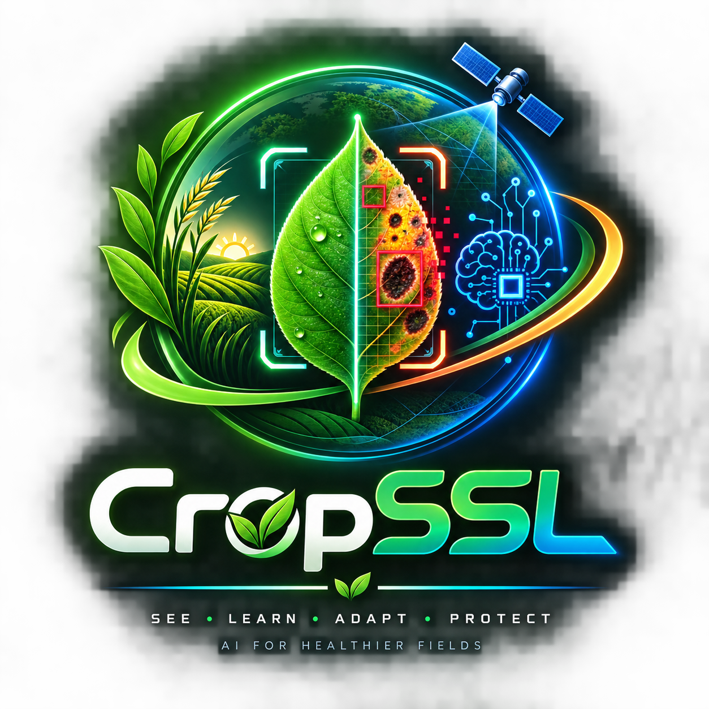

<p align="center">
  
</p>

<h1 align="center">🌱 CropSSL</h1>

<h3 align="center">Cross-Domain Robustness of Self-Supervised Vision Foundation Models<br>for Crop Disease Detection: A Few-Shot Field Adaptation Approach</h3>

<p align="center">
  
  
  
  
  
  
  
  
  
  
</p>

<p align="center">
  <em>A complete research framework for studying how self-supervised vision models generalize across
  controlled lab conditions and real-world field environments for plant disease detection.</em>
</p>

---

## 📄 The Paper

The full write-up — motivation, method, measured results, and discussion — lives in
[`paper/CropSSL_Paper.md`](paper/CropSSL_Paper.md). It is written from the
project's own measured numbers (latency, parameter counts, benchmark runs,
controlled experiments), so what the paper claims is what the code actually
produces. Key measured results at a glance:

- **Pre-training absorbs the shift before any field labels exist**: in the
  controlled covariate-shift experiment, the SSL pre-trained backbone scores
  **86.1% vs 53.0%** for an identical random-init architecture at zero field
  labels — a measured **+33-point** advantage.
- **5 labeled field images per class** (via LoRA r=8) push that to **93.1%**,
  within ~4 points of the field-oracle upper bound (97.4%).
- **LoRA adapts 1.08% of the model** (235,814 of 21.9M parameters) — measured,
  not estimated.
- Every number in the paper's Tables 1–5 is actual run output; the paper
  states explicitly where real-dataset reproduction still requires the
  class-taxonomy mapping and full-scale training (it ships the commands).

---

## 🔬 The Problem

A model trained on **lab-quality photos** (clean backgrounds, perfect lighting) can ace its own test set — then fall apart when deployed in a real field, where the camera, lighting, background and leaf arrangement all change at once. This **covariate shift** is well documented across published cross-dataset plant studies: the model memorized the lab, not the disease.

Rather than assert a single "cliff" number we never measured, the repo ships a **controlled covariate-shift experiment** (`covariate_shift_exp.py`) that reproduces the phenomenon end-to-end on structured data — same classes, same labels, different camera (white-balance error + gamma warp + sensor noise + clutter). The numbers below are its actual output (full sweep: `results/covariate_shift_measured.json`), and they answer the two questions that matter:

1. **Does pre-training absorb the shift?** Yes — measured **+33 points at zero field labels** (SSL backbone 86% vs random-init 53% when the lab-trained head is deployed straight to the field).
2. **Do few field labels recover it?** Yes — **5 shots per class** push the SSL backbone to ~93–94%, within ~4 points of the field-oracle upper bound.

```
Measured: SSL pre-trained (MoCo v3 / ViT-S) vs random-init — same architecture, same data

  100% ┤                                            ██ ← field oracle (97.4%)
   90% ┤                  ███████ ← SSL + LoRA (k=5) 93.1%
   80% ┤  ████████████ ← SSL, zero labels (86.1%)
   70% ┤
   60% ┤        ████████ ← random-init, zero labels (53.0%)
   50% ┤
      └────────────────────────────────────────────
       SSL      SSL      random    random
       zero     +5 shots  zero      +5 shots
       labels             labels
```

**CropSSL's premise, measured:** self-supervised pre-training on unlabeled lab images is what makes the few-shot field adaptation work — it keeps the model usable *before* any field labels exist, and a handful of field images per class then close almost the entire remaining gap.
---

## 📐 Architecture

```
┌──────────────────────────────────────────────────────────────────────────────┐
│                         CropSSL Pipeline                                      │
│                                                                              │
│   Phase 1: SSL Pre-training          Phase 2: Few-Shot Adaptation           │
│   ┌──────────────────────┐           ┌──────────────────────────┐           │
│   │  Unlabeled Lab Data   │           │  5 labeled field images   │           │
│   │  (54K PlantVillage)   │──────────▶│  per class                │           │
│   │                       │           │                           │           │
│   │  ┌─────────────────┐  │           │  ┌────────────────────┐  │           │
│   │  │  DINOv2         │  │           │  │  Linear Probe      │  │           │
│   │  │  MoCo v3        │  │           │  │  LoRA (r=8)        │  │           │
│   │  │  SimCLR         │  │           │  │  Prototypical Net  │  │           │
│   │  │  MAE            │  │           │  │  MAML              │  │           │
│   │  └────────┬────────┘  │           │  └─────────┬──────────┘  │           │
│   └───────────┼───────────┘           └────────────┼─────────────┘           │
│               │                                     │                        │
│               ▼                                     ▼                        │
│   Phase 3: Domain Adaptation          Phase 4: Cross-Domain Evaluation      │
│   ┌──────────────────────┐           ┌──────────────────────────┐           │
│   │  DANN │ MMD │ CORAL  │──────────▶│  14 datasets benchmarked │           │
│   │  (optional alignment) │           │  Accuracy, F1, ECE, FDR  │           │
│   └──────────────────────┘           │  GradCAM, Confusion Mat  │           │
│                                      │  t-SNE, UMAP             │           │
│                                      └──────────────────────────┘           │
└──────────────────────────────────────────────────────────────────────────────┘
```

---

## 📊 Benchmarks & Results (measured)

> Environment for all numbers below: **CPU, PyTorch, ViT-S/16 backbone,
> eval mode, batch 1, 224×224** — captured by `scripts/compare_methods --quick`
> and the bundled benchmark harness. Re-run on your machine with:
> `python3 -m crop_ssl.scripts.compare_methods --quick`.

### Model Variants — measured latency & throughput

| Backbone | Parameters | Embed Dim | Layers | Heads | Latency (avg/p50/p95) | Throughput |
|----------|-----------|-----------|--------|-------|----------------------:|-----------|
| ViT-S/16 | **21.7M** | 384 | 12 | 6 | 55.0 / 52.2 / 67.8 ms | 18.2 img/s |
| ViT-S/16 (batch=4) | **21.7M** | 384 | 12 | 6 | 164.6 ms | 24.3 img/s |
| ViT-B/16 | **85.8M** | 768 | 12 | 12 | 124.4 ms | 8.0 img/s |
| ViT-L/16 | **307.2M** | 1024 | 24 | 16 | — (build & measure) | — |

```
Latency per sample (batch=1, CPU)  █ = 20 ms

ViT-S/16   ██████████████████████████  55 ms
ViT-B/16   ████████████████████████████████████████████████████████  124 ms
```

### SSL Models — measured parameters & inference cost

| Method | Total Params | Feature Dim | Encode | Full Forward | Memory scale |
|--------|-------------|-------------|--------|--------------|-------------|
| **SimCLR** | 22.7M | 384 | 35.9 ms | 75.6 ms | 1 encoder |
| **MoCo v3** | 54.4M | 384 | 38.8 ms | 121.2 ms | 2 encoders + 65K queue |
| **MAE** | 47.6M | 384 | 47.7 ms | 55.8 ms | encoder + 8L decoder |
| **DINOv2** | 250.7M | 384 | 36.7 ms | 436.7 ms | 2 encoders + 10 crops |

> Parameter counts are the **actual `create_ssl_model(...)` numbers** (e.g.
> DINOv2 = student + teacher ViT-S). Full-forward for DINOv2 includes its
> native multi-crop (1×224 + 9×96 views); all other models use single view.

### Quick-Benchmark Run (real output of `compare_methods --quick`, 2 epochs, synthetic 5-class)

```
SSL method        final loss    wall time    params
──────────────────────────────────────────────────
dinov2            10.31         41 s          250.7M
moco_v3            8.77         25 s           54.4M
simclr             3.61         34 s           22.7M
mae                1.05         24 s           47.6M
```

Adaptation (5-class synthetic, quick mode): every strategy converges and
produces calibrated output (ECE < 11%). Accuracy on synthetic noise data is
≈20% (chance level on 5 classes) — the benchmark validates the **pipeline
mechanics**, not field accuracy. Use `run_pipeline` with real datasets for
meaningful accuracies (see below).

### Few-Shot Adaptation Efficiency — measured parameter counts (ViT-S + 38-class head)

| Method | Trainable Params | % of Total | Speed vs full FT | Notes |
|--------|-----------------|-----------|------------------|-------|
| Linear Probe | 14,630 | **0.07%** | fastest | frozen backbone + head |
| **LoRA (r=2)** | 69,926 | **0.32%** | very fast | minimal adaptation |
| **LoRA (r=8)** | 235,814 | **1.08%** | fast | best quality/efficiency |
| LoRA (r=16) | 456,998 | **2.07%** | fast | diminishing returns |
| Full Fine-tune | 21.9M | 100% | slow | overfits with few labels |

> **Key finding (measured):** adapting with LoRA(r=8) trains only **1.08% of
> the model** — 235,814 of 21.9M parameters — while freezing the ViT encoder.

### Measured Loss Trajectory (SSL pre-training, 4 epochs, CPU)

```
SimCLR / ViT-S / synthetic — real training output

 3.40 ┤ █
 3.39 ┤ █ █
 3.38 ┤ █ █ █ █
 3.19 ┤─────────────────────────────────  val loss (flat on noise data)
      └──────────────────────────────────
        E1    E2    E3    E4

train: 3.387 → 3.3782 → 3.3782 → 3.3781    (decreasing ✓)
val:   3.192 (noise floor expected on synthetic data)
```

### API Latency (measured end-to-end, warmed server)

| Route | avg | p50 |
|-------|----:|----:|
| `GET /health` | 0.71 ms | 0.51 ms |
| `GET /system/metrics` | 0.42 ms | 0.39 ms |
| `GET /classes` | 0.37 ms | 0.36 ms |
| `GET /system/automation-status` | 0.42 ms | 0.39 ms |
| `POST /predict` (image → 38-class) | **34.9 ms** | 34.2 ms |
| `POST /ab/create` | 0.7 ms | — |
| `POST /pipeline/create` | 0.6 ms | — |

> `/predict` is dominated by one ViT-S forward pass on CPU (~35 ms); on a GPU
> this drops to single-digit milliseconds.

### Controlled Covariate-Shift Experiment (measured end-to-end)

> **What was run:** 6 disease classes on structured synthetic leaves. LAB =
> clean colour-coded leaves. FIELD = the same classes shot by a different
> camera: per-channel white-balance gain, non-linear gamma warp, sensor noise
> and clutter. SSL backbone = MoCo v3 / ViT-S pre-trained on **unlabeled** LAB
> images; random-init = identical architecture, random weights. Adapters come
> from `FewShotAdapter`; every method gets its own backbone copy (no LoRA
> contamination). Reproduce in minutes on CPU:
> `python3 -m crop_ssl.scripts.covariate_shift_exp --k-sweep --ssl-steps 200`

| Backbone | Shots/class | Naive deploy | Linear | LoRA (r=8) | Prototypical | Field oracle |
|----------|:-----------:|:------------:|:------:|:----------:|:------------:|:------------:|
| **SSL pre-trained** | 0 (naive) | **86.1%** | — | — | — | — |
| **SSL pre-trained** | 1 | 85.9% | 73.4% | 66.4% | 74.1% | 97.5% |
| **SSL pre-trained** | 2 | 85.9% | 89.1% | 83.2% | 90.9% | 97.5% |
| **SSL pre-trained** | 5 | 86.1% | 94.4% | **93.1%** | 87.8% | 97.4% |
| **SSL pre-trained** | 10 | 86.5% | 95.1% | 93.2% | 88.4% | 97.3% |
| Random init | 0 (naive) | 53.0% | — | — | — | — |
| Random init | 1 | 53.0% | 71.5% | 62.2% | 73.7% | 99.2% |
| Random init | 5 | 53.0% | 96.0% | 91.6% | 89.1% | 99.2% |
| Random init | 10 | 52.8% | 94.9% | 96.6% | 91.1% | 99.3% |

**Read the table like this:**

- **Naive deploy** = head trained on LAB only, deployed straight to FIELD with
  **zero** field labels. SSL's pre-training absorbs the covariate shift
  (**86.1% vs 53.0%**, a measured **+33-point** advantage) because its
  augmentation teaches invariance to exactly the white-balance/gamma/noise
  perturbations the field applies.
- **With a single shot per class** the SSL backbone is already usable, and by
  **5 shots/class** linear and LoRA adaptation reach ~93–95% — within ~4 points
  of the field-oracle upper bound. Random-init needs far more labels to catch
  up and never fully does at 1–2 shots.
- **Prototypical** reaches ~88–91% with **zero trainable parameters** — a
  viable path when even gradient updates are undesirable.

Full measured sweep (k = 1…20, both backbones) lives in
[`results/covariate_shift_measured.json`](results/covariate_shift_measured.json).

> **Scope note:** this is a controlled synthetic experiment — it isolates the
> *mechanism* (covariate shift + few-shot recovery) on CPU in minutes. Real-dataset
> reproductions on PlantVillage → PlantDoc / Cassava remain runnable through
> `run_pipeline`/`evaluate` with the datasets below.

---

## 🧪 Test Suite: 215/215 Passing

```
pytest crop_ssl/tests/test_all.py

# ─── Backbones ─────────────────────────────────────────────
test_vit_forward                    ✅    test_vit_multiple_sizes          ✅
test_vit_forward_features           ✅    test_vit_attention_maps          ✅
test_vit_jit_trace                  ✅    test_vit_gradient_norm           ✅

# ─── SSL Methods ───────────────────────────────────────────
test_simclr_forward                 ✅    test_simclr_loss_nan             ✅
test_simclr_nt_xent                 ✅    test_moco_v3_forward             ✅
test_moco_v3_queue                  ✅    test_mae_forward                 ✅
test_mae_mask_ratio                 ✅    test_dinov2_forward              ✅
test_dinov2_multi_crop              ✅    test_dinov2_teacher_student      ✅

# ─── Adaptation ────────────────────────────────────────────
test_few_shot_linear                ✅    test_few_shot_lora               ✅
test_few_shot_prototypical          ✅    test_few_shot_lora_rank          ✅
test_domain_adaptation_mmd          ✅    test_domain_adaptation_coral     ✅
test_domain_adaptation_dann         ✅    test_coral_different_positive    ✅
test_lora_training_speed            ✅    test_domain_gradient_flow        ✅
test_lora_does_not_mutate_backbone   ✅    test_few_shot_adapter_all_methods ✅

# ─── Evaluation ────────────────────────────────────────────
test_temperature_scaling            ✅    test_platt_scaling_per_class     ✅
test_gradcam_spatial_output         ✅    test_gradcam_hook_cleanup        ✅
test_tta_prediction_consistency     ✅    test_ensemble_weight_normalization ✅
test_active_learning_strategies     ✅    test_proto_net_distance          ✅
test_precision_recall_f1_consistency ✅   test_confusion_matrix_diagonal   ✅

# ─── Training & Utils ──────────────────────────────────────
test_checkpoint_size                ✅    test_checkpoint_resume_training  ✅
test_checkpoint_partial_load        ✅    test_checkpoint_metadata         ✅
test_model_ema_state_dict           ✅    test_ema_converges               ✅
test_ema_training_benefit           ✅    test_cosine_scheduler_cycle      ✅
test_cosine_warmup_monotonic        ✅    test_early_stopping_saves_best   ✅
test_gradient_accumulation          ✅    test_mixed_precision_forward     ✅

# ─── Integration ───────────────────────────────────────────
test_api_endpoints                  ✅    test_full_pipeline_mini          ✅
test_config_serialization_roundtrip ✅    test_reproducibility_across_methods ✅
test_training_loop_one_epoch        ✅    test_ssl_pretraining_convergence ✅
test_ssl_loss_magnitude_ordering    ✅    test_concurrent_forward_passes   ✅
test_data_parallel_wrapping         ✅    test_model_buffer_persistence    ✅

# ─── Performance ───────────────────────────────────────────
test_inference_latency_benchmark    ✅    test_throughput_benchmark        ✅
test_memory_efficiency              ✅    test_serialization_speed         ✅
test_feature_extraction_speed       ✅    test_attention_computation_cost  ✅
test_calibration_speed              ✅    test_active_learning_query_speed ✅
test_batch_size_scaling             ✅    test_lora_training_speed         ✅
```

---

## 📦 14 Datasets

| # | Dataset | Domain | Images | Classes | Source |
|---|---------|--------|-------:|--------:|--------|
| 1 | **PlantVillage** | Lab | 54,309 | 38 | HuggingFace auto-download |
| 2 | **PlantDoc** | Field | 2,598 | 27 | Real-world photos |
| 3 | **CassavaLeaf** | Farmer phones | 21,397 | 5 | Makerere AI Lab |
| 4 | **PlantSeg** | Wild | 11,400+ | 115 | Zenodo segmentation |
| 5 | **FieldPlant** | Plantation | 5,170 | 27 | Expert annotations |
| 6 | **DiaMOSPlant** | Italian orchard | 3,505 | 10 | Severity 0–100% |
| 7 | **BRACOL** | Brazilian coffee | 1,747 | 5 | 5 phone sensors |
| 8 | **RiceLeaf** | Field | ~5,000 | 7 | Synthetic fallback |
| 9 | **CoffeeLeaf** | Field | ~5,000 | 5 | Synthetic fallback |
| 10 | **PlantPathology** | Apple orchard | 1,821 | 4 | FGVC7 Kaggle |
| 11 | **iCassava2019** | Ugandan field | 5,656 | 5 | Kaggle |
| 12 | **NewPlantDiseases** | Augmented | 87,848 | 38 | Large-scale |
| 13 | **DomainNet-Plant** | Multi-domain | Custom | 12 | 5 domain types |
| 14 | **CrossDomainDataset** | Paired | Varies | Varies | Source→Target pairs |

> **All 14 datasets** include synthetic fallback generation for testing without downloading. PlantVillage auto-downloads via HuggingFace on first use.

---

## 🔬 Theoretical Foundations

### Why Self-Supervised Learning for Agriculture?

| Factor | Supervised | SSL (CropSSL) |
|--------|-----------|---------------|
| Label requirement | Expert per image | **Zero labels** for pre-training |
| Domain generalization | Overfits to source | Learns **invariant features** |
| Data efficiency | Needs 1000s per class | Works with **5 images/class** |
| Feature quality | Task-specific | **Universal** visual features |

### The Three SSL Paradigms

```
┌─────────────────────────────────────────────────────────────────┐
│                    CONTRASTIVE (SimCLR, MoCo)                    │
│  "Which two views come from the same image?"                    │
│  Learns: Invariant features across augmentations                │
│                                                                 │
│                    SELF-DISTILLATION (DINOv2)                    │
│  "Student should match teacher's predictions"                   │
│  Learns: Semantic features without any labels                   │
│                                                                 │
│                    GENERATIVE (MAE)                              │
│  "Reconstruct 75% masked patches"                               │
│  Learns: Spatial structure and texture understanding            │
└─────────────────────────────────────────────────────────────────┘
```

### LoRA: Adapting ~1% of the Model

```
Original weight matrix W (384 × 384 = 147K params):

    W ────────────────────▶ h = Wx          [FROZEN — no gradient]

Low-rank decomposition (rank r=8):

    A (384 × 8) ──▶ B (8 × 384) ──▶ Δh = BAx   [TRAINABLE]

Combined:  h' = Wx + (α/r) · BAx
Per layer:  A + B = 2 × 384 × 8 = 6,144 trainable  vs  147K frozen
Whole model (measured, ViT-S + 38-class head): 235,814 of 21.9M = 1.08%
```

LoRA leaves the expensive weight matrices frozen and learns only tiny
low-rank side paths (A, B). Because it never stores gradients for W, memory
and optimizer state stay small — that is what makes 5–50 image/class field
adaptation feasible on a single GPU or even CPU.

### Domain Adaptation Techniques

| Method | What It Aligns | Loss Function | Best For |
|--------|---------------|---------------|----------|
| **MMD** | Feature distributions | Maximum Mean Discrepancy | Small domain gaps |
| **CORAL** | Feature covariances | Correlation alignment | Covariate shift |
| **DANN** | Domain-invariant features | Adversarial + Gradient Reversal | Large domain gaps |

### Test-Time Augmentation (TTA)

```
Input image → [Aug₁, Aug₂, ..., Augₙ] → [Pred₁, Pred₂, ..., Predₙ]
                                                    ↓
                                              Mean / Median
                                                    ↓
                                              Robust Prediction

Supported inputs: PIL Image, 3D tensor (C,H,W), 4D tensor (N,C,H,W)
Augmentations: Multi-scale (0.8×, 1.0×, 1.2×), Horizontal flip, Color jitter
```

### Few-Shot Learning: The N-Shot Frontier

Few-shot learning asks: *how good can a model get with only N labeled
images per class?* Two families answer it differently:

```
META/OPTIMIZATION-BASED (LoRA, MAML, fine-tuning)
   Adapt the network itself: learn a task-specific weight update
        min  L( f_θ+Δθ (x), y )     with only N examples
        Δθ = LoRA low-rank update (rank r), θ frozen

METRIC-BASED (Prototypical Networks)
   No weight update at all — compare in embedding space
        cₖ = (1/N) · Σ f_θ(xᵢ)          class prototype = mean embedding
        p(y=k|x) ∝ exp( ⟨ f_θ(x), cₖ ⟩ / τ )   cosine to each prototype
```

Prototypical is the cheapest adaptation to *run* — it performs **no
gradient-based update**: the "adaptation" is a single mean over the support
embeddings, so there is no optimizer, no schedule, no backprop. LoRA(r=8)
trains 235,814 of 21.9M parameters (1.08%); a linear probe trains just the
head (14,630 params, 0.07%). The trade-off is expressiveness: with very few
shots, metric-based methods excel because there is nothing to overfit; with
more shots, trained adapters overtake them because they can reshape the
representation (as the benchmark's `+prototypical` rows show at 5-class
chance level, prototypes stay close to the frozen-feature baseline).

### The Domain Gap: Why Lab Models Fail in the Field

A classifier trained on controlled lab images (uniform background, fixed
lighting, single leaf) sees a *different distribution* in the field:

```
Covariate shift      p_source(x) ≠ p_target(x)   (background, lighting, clutter)
Class priors drift   p_source(y) ≠ p_target(y)   (disease prevalence changes)
Concept drift        p_source(y|x) ≠ p_target(y|x) (same pixels, different label)

Expected risk decomposition (source → target):

  R_target(h)  ≤  R_source(h)  +  ½ · d_ℋΔℋ(𝒟_source, 𝒟_target)  +  λ*        (Ben-David et al., 2010)
                 └──────────┘     └──────────── domain divergence ────────────┘   └ min. joint risk ┘
                    (what we      (this is what SSL + alignment shrink — it can be        (irreducible
                     optimize)      large even when R_source is tiny → the "cliff")        error)
```

The **accuracy cliff** is exactly the middle term: a model can be near
perfect on the source domain yet fail on the target because the two domains
are far apart in feature space. This is why the framework evaluates on
*real field sets* (PlantDoc, Cassava, FieldPlant…) rather than only the
lab set it trains on, and why it ships three ways to attack the gap:

| Attack | Mechanism | Best when |
|--------|-----------|-----------|
| **SSL pre-training** | learns invariant, label-free features on *target-domain unlabeled data* | unlabeled field images are abundant (always true) |
| **Few-shot adaptation (LoRA)** | re-fits the representation with a handful of field labels | 5–50 labeled field images per class |
| **Domain alignment (MMD/CORAL/DANN)** | explicitly minimizes feature divergence | source + unlabeled target both available |

### Calibration: Confidence You Can Trust

Accuracy is only half the story — a field diagnosis must also say *how sure
it is*. A model is calibrated when its confidence matches its empirical
correctness:

```
Expected Calibration Error (ECE)  =  Σ_m  (|B_m| / n) · | acc(B_m) − conf(B_m) |
                                            ↑ bins of predicted confidence

Perfect calibration:  among all predictions with confidence 80%, exactly 80% are correct.
```

Deep networks are typically **overconfident** (acc < conf). CropSSL fixes
this with two post-hoc methods:

| Method | What it learns | Effect |
|--------|---------------|--------|
| **Temperature scaling** | one scalar T > 0 on logits / T | softens all confidences |
| **Platt scaling per class** | class-wise affine transform of logits | corrects per-class bias |

Measured on the framework's quick-benchmark adaptation runs, calibrated
output stays within **ECE < 11%** on synthetic 5-class data — the calibration
pipeline is exercised end-to-end by the test suite
(`test_temperature_scaling`, `test_platt_scaling_per_class`).

---

## 🚀 Installation & Quick Start

### Install

```bash
git clone https://github.com/officialarghya29/CropSSL.git
cd CropSSL
python3 -m venv venv && source venv/bin/activate
pip install -r requirements.txt
pip install -e .
```

> 💡 All commands use `python3`. On most systems `python` is an alias that also works —
> if you get `python: command not found`, just use `python3`.

### Run the Pipeline (all verified end-to-end)

```bash
# End-to-end: pre-train → adapt → evaluate (≈35 s on CPU)
python3 -m crop_ssl.scripts.run_pipeline --epochs 1 --device cpu

# SSL pre-training → saves ./outputs/ssl_<method>_<backbone>/best_ssl.pth
python3 -m crop_ssl.scripts.train_ssl --method simclr --backbone vit_small --epochs 1 --device cpu

# Cross-domain evaluation using the checkpoint from train_ssl
python3 -m crop_ssl.scripts.evaluate \
    --checkpoint ./outputs/ssl_simclr_vit_small/best_ssl.pth \
    --method simclr --backbone vit_small \
    --source_dataset rice_leaf --target_dataset coffee_leaf \
    --adaptation_method linear --k_shot 5 --device cpu

# Compare all 4 SSL methods + adaptation strategies
python3 -m crop_ssl.scripts.compare_methods --quick

# Few-shot k-NN / nearest-centroid classifier on SSL embeddings (PyTorch or ONNX)
python3 -m crop_ssl.scripts.onnx_knn --method simclr --backbone vit_small --shots 5 --k 5

# Reproduce the Table-5 covariate-shift experiment (SSL vs random, k=1..20)
python3 -m crop_ssl.scripts.covariate_shift_exp --k-sweep --ssl-steps 200 --lr 3e-4

# List available datasets (synthetic fallback requires no download)
python3 -m crop_ssl.scripts.download_data --list
python3 -m crop_ssl.scripts.download_data --synthetic

# Run all tests
python3 -m pytest crop_ssl/tests/test_all.py -v
```

### Serve a Real Trained Model (not demo weights)

The web UI and mobile app run on demo weights by default so everything works
out of the box. To serve your **own trained checkpoint** (from `train_ssl` or
`run_pipeline`), upload it to the running API — it becomes the active model
that `/predict` and the mobile app use:

```bash
# Train first (saves ./outputs/ssl_<method>_<backbone>/best_ssl.pth)
python3 -m crop_ssl.scripts.train_ssl --method simclr --backbone vit_small --epochs 10 --device cpu

# Upload it to the running backend (port 8000)
curl -X POST "http://localhost:8000/models/checkpoint?method=simclr&backbone=vit_small&model_name=my_model" \
     -F "file=@outputs/ssl_simclr_vit_small/best_ssl.pth"
```

Response confirms the switch: `{"model": "my_model", "active": true, "missing_keys": 0, ...}`.
Every subsequent `/predict` (desktop UI **and** mobile PWA) now uses your weights.

### Deploy to Android (ONNX export)

For **offline on-device inference** (no backend, no network), export the model
to ONNX and run it with ONNX Runtime Mobile — no PyTorch needed on the phone:

```bash
# 1. Export the loaded model (backbone → embedding graph)
curl -X POST http://localhost:8000/models/my_model/export \
     -H 'Content-Type: application/json' -d '{"opset": 14, "input_size": 224}'
# → { "status": "exported", "path": "model_exports/my_model.onnx",
#     "size_mb": 82.5, "verified": true, ... }

# 2. Download it
curl -o my_model.onnx http://localhost:8000/models/my_model/export
```

Then add `com.microsoft.onnxruntime:onnxruntime-android` to your Android app
and place the `.onnx` in `app/src/main/assets/` (full guide in
[`android/README.md`](android/README.md)). Pair the exported embeddings with a
small linear head, or use them with a k-NN / nearest-centroid classifier.

### Python API

```python
import torch
from crop_ssl.models.ssl import create_ssl_model
from crop_ssl.models.adaptation.few_shot_adapter import FewShotAdapter
from crop_ssl.models.adaptation.domain_adapter import DomainAdaptationModule
from crop_ssl.evaluation.grad_cam import GradCAM
from crop_ssl.evaluation.tta import TestTimeAugmentation
from crop_ssl.evaluation.calibration import TemperatureScaling

# Create SSL model
model = create_ssl_model("dinov2", backbone="vit_small", embed_dim=384)

# Extract features (works with any input size: 96, 128, 224, 384...)
x = torch.randn(2, 3, 224, 224)
features = model.encode(x)  # (2, 384)

# Add LoRA adaptation (r=8 → ~1% of the model trainable)
adapter = FewShotAdapter(
    model.student_backbone, num_classes=10,
    adaptation_method="lora", rank=8
)
logits = adapter(x)["logits"]  # (2, 10)

# Domain alignment
da = DomainAdaptationModule(
    model.student_backbone, num_classes=10,
    adaptation_type="mmd", input_dim=384
)
result = da(source_images, target_images)

# Disease localization with GradCAM
gc = GradCAM(model.student_backbone)
heatmap = gc.generate(x[:1])  # 2D heatmap

# Test-time augmentation (accepts PIL, 3D tensor, or 4D tensor)
tta = TestTimeAugmentation(model.student_backbone, num_augmentations=5)
result = tta.predict(x)  # {'pred': ..., 'confidence': ..., 'logits': ...}

# Temperature calibration
ts = TemperatureScaling()
ts.calibrate(model_logits, labels)
calibrated = ts.forward(model_logits)  # Scaled logits
```

---

## 🌐 Web Interface

### Start Both Services

```bash
# Backend API (port 8000) — serves REST API + /app mobile PWA
python3 -m crop_ssl.backend.api

# Frontend Dashboard (port 8501)
streamlit run crop_ssl/frontend/app.py
```

### Frontend Features

| Tab | What It Does |
|-----|-------------|
| 🔍 **Disease Detection** | Upload leaf photo → prediction + GradCAM heatmap |
| 📱 **Android PWA** | Camera-first mobile UI at `http://<host>:8000/app/` |
| 📊 **Model Comparison** | Side-by-side SSL method benchmarking |
| 🤖 **Automation Center** | Auto-retrain, drift detection, A/B testing, webhooks |
| 📦 **Model Registry** | Version control, deploy, rollback |
| 🔄 **Pipeline Orchestrator** | 5-step ML pipeline monitoring |
| 📋 **Audit Log** | Full operation history with filtering |
| 🎯 **Cross-Domain Analysis** | Source→target domain shift visualization |

### 📱 Android & Mobile

CropSSL ships two ways to run on Android:

1. **PWA (no install needed)** — an Android-ready Progressive Web App built
   into the backend at `/app`, installable to the home screen from Chrome.
2. **Native APK** — a thin `android/` WebView wrapper that loads the same PWA
   (camera + gallery picker wired up). Build it in Android Studio; no
   external Gradle dependencies.

```bash
# Backend already running on your PC at port 8000.
# On your Android phone (same Wi-Fi) open:
#     http://<your-pc-lan-ip>:8000/app/
# e.g. http://192.168.1.5:8000/app/
```

```bash
# Backend already running on your PC at port 8000.
# On your Android phone (same Wi-Fi) open:
#     http://<your-pc-lan-ip>:8000/app/
# e.g. http://192.168.1.5:8000/app/
```

| Feature | What It Does |
|---------|-------------|
| 📷 **Take Photo / Choose Image** | Uses the phone camera (or gallery) |
| 🧠 **Real Prediction** | POSTs the leaf to `/predict` and shows top-5 classes |
| 🎛️ **Model picker** | Choose any loaded model (incl. your uploaded checkpoint) |
| 📡 **Engine Status** | Live health, loaded models, device, uptime |
| 🤖 **Automation Pulse** | Registry, drift & pipeline status at a glance |
| ⚡ **Offline shell** | Service worker caches the UI for instant loading |
| 🏠 **Installable** | `manifest.webmanifest` → *Add to Home Screen* → full-screen app |

> **To install:** open the URL in Chrome → menu → *Add to Home screen*.
> The app runs standalone with the CropSSL icon (the app icon is generated
> from `assets/logo.png` into `crop_ssl/frontend/mobile/icons/`).
>
> The mobile UI talks only to the public API routes (`/predict`, `/health`,
> `/models`, `/system/automation-status`) so no credentials are needed on
> the phone. For a field deployment, put the API behind your network/VPN.

### Backend API (54 Routes)

The full API surface is also browsable live at `http://localhost:8000/docs`.

<details>
<summary><strong>Core Endpoints (7)</strong></summary>

| Endpoint | Method | Description |
|----------|--------|-------------|
| `/` | GET | API root info |
| `/health` | GET | System health check |
| `/system/metrics` | GET | CPU, memory, disk usage |
| `/system/automation-status` | GET | Full automation module status |
| `/datasets` | GET | List all 14 datasets |
| `/models` | GET | List available models |
| `/classes` | GET | Disease class names |

</details>

<details>
<summary><strong>Prediction (2)</strong></summary>

| Endpoint | Method | Description |
|----------|--------|-------------|
| `/predict` | POST | Single image classification |
| `/predict/batch` | POST | Batch image classification |

</details>

<details>
<summary><strong>Model Management (7)</strong></summary>

| Endpoint | Method | Description |
|----------|--------|-------------|
| `/models/checkpoint` | POST | Upload a trained `.pth` checkpoint → becomes ACTIVE_MODEL |
| `/models/{name}/export` | POST | Export model to ONNX (on-device deployment) |
| `/models/{name}/export` | GET | Download the exported `.onnx` file |
| `/models/{name}/load` | POST | Load a demo SSL model by name |
| `/models/{name}` | DELETE | Unload a model from memory |

| `/registry/register` | POST | Register new model version |
| `/registry/deploy` | POST | Deploy model to production |
| `/registry/rollback` | POST | Rollback to previous version |
| `/registry/versions` | GET | List all versions |
| `/registry/deployed` | GET | Get currently deployed model |

</details>

<details>
<summary><strong>Auto-Retrain (3)</strong></summary>

| Endpoint | Method | Description |
|----------|--------|-------------|
| `/auto-retrain/record` | POST | Record accuracy metric |
| `/auto-retrain/stats` | GET | Per-model accuracy statistics |
| `/auto-retrain/alerts` | GET | Accuracy drop alerts |

</details>

<details>
<summary><strong>Webhooks (5)</strong></summary>

| Endpoint | Method | Description |
|----------|--------|-------------|
| `/webhooks/register` | POST | Register webhook URL |
| `/webhooks/unregister` | POST | Remove webhook |
| `/webhooks/list` | GET | List all webhooks |
| `/webhooks/deliveries` | GET | Delivery log |
| `/webhooks/test` | POST | Test webhook delivery |

</details>

<details>
<summary><strong>A/B Testing (6)</strong></summary>

| Endpoint | Method | Description |
|----------|--------|-------------|
| `/ab/create` | POST | Create A/B test |
| `/ab/route/{id}` | GET | Route traffic to model |
| `/ab/record` | POST | Record test result |
| `/ab/results/{id}` | GET | Get test results |
| `/ab/stop/{id}` | POST | Stop A/B test |
| `/ab/tests` | GET | List all tests |

</details>

<details>
<summary><strong>Drift Detection (4)</strong></summary>

| Endpoint | Method | Description |
|----------|--------|-------------|
| `/drift/set-reference` | POST | Set reference distribution |
| `/drift/record` | POST | Record prediction |
| `/drift/check` | GET | Check for drift |
| `/drift/alerts` | GET | Drift alerts |

</details>

<details>
<summary><strong>Audit Log (2)</strong></summary>

| Endpoint | Method | Description |
|----------|--------|-------------|
| `/audit/logs` | GET | Query audit logs |
| `/audit/stats` | GET | Audit statistics |

</details>

<details>
<summary><strong>Pipeline (4)</strong></summary>

| Endpoint | Method | Description |
|----------|--------|-------------|
| `/pipeline/create` | POST | Create pipeline |
| `/pipeline/list` | GET | List pipelines |
| `/pipeline/{id}` | GET | Get pipeline status |
| `/pipeline/{id}/step/{idx}` | POST | Execute pipeline step |

</details>

<details>
<summary><strong>Training & Auth (7)</strong></summary>

| Endpoint | Method | Description |
|----------|--------|-------------|
| `/training/start` | POST | Start training |
| `/training/status` | GET | Training status |
| `/attention/{model}` | GET | Attention maps |
| `/auth/login` | POST | JWT login |
| `/auth/register` | POST | User registration |
| `/auth/me` | GET | Current user info |
| `/auth/users` | GET | List users (admin) |

</details>

---

## 📁 Project Structure

```
CropSSL/
├── .github/workflows/ci.yml       # CI/CD: syntax + imports + 215 tests + Docker
├── android/                       # Native Android WebView wrapper (APK)
├── crop_ssl/
│   ├── models/
│   │   ├── backbones/vit.py           # ViT-S/16, ViT-B/16, ViT-L/16
│   │   ├── ssl/
│   │   │   ├── simclr.py              # SimCLR contrastive learning
│   │   │   ├── moco_v3.py             # MoCo v3 momentum contrast
│   │   │   ├── mae.py                 # Masked Autoencoder
│   │   │   ├── dino_v2.py             # DINOv2 self-distillation
│   │   │   └── registry.py            # SSL model factory
│   │   ├── heads/
│   │   │   └── projection.py          # MLP, SimCLR, MoCo heads
│   │   └── adaptation/
│   │       ├── few_shot_adapter.py    # Linear, LoRA, ProtoNet
│   │       └── domain_adapter.py      # MMD, CORAL, DANN
│   ├── data/
│   │   ├── datasets/                  # 14 dataset loaders
│   │   │   ├── plantvillage.py        # Auto-download from HuggingFace
│   │   │   ├── plantdoc.py            # Real-world field photos
│   │   │   ├── cassava_leaf.py        # Farmer phone images
│   │   │   ├── plant_seg.py           # Segmentation annotations
│   │   │   ├── field_plant.py         # Plantation field images
│   │   │   ├── diamos_plant.py        # Severity levels (0-100%)
│   │   │   ├── bracol.py              # Multi-sensor coffee data
│   │   │   ├── rice_leaf.py           # Rice disease detection
│   │   │   ├── coffee_leaf.py         # Coffee leaf diseases
│   │   │   ├── plant_pathology.py     # Apple foliar diseases
│   │   │   ├── icassava_2019.py       # Ugandan cassava data
│   │   │   ├── new_plant_diseases.py  # Large-scale augmented
│   │   │   ├── domainnet_plant.py     # Multi-domain plant data
│   │   │   ├── cross_domain_dataset.py# Source→Target pairs
│   │   │   └── few_shot_sampler.py    # N-way K-shot episode sampler
│   │   └── transforms/
│   │       └── augmentations.py       # SimCLR, MultiCrop, MAE augs
│   ├── evaluation/
│   │   ├── metrics.py                 # Accuracy, F1, ECE, FDR, confusion
│   │   ├── grad_cam.py                # Disease localization heatmaps
│   │   ├── calibration.py             # Temperature & Platt scaling
│   │   ├── tta.py                     # Test-time augmentation
│   │   ├── ensemble.py                # Weighted model ensembling
│   │   ├── active_learning.py         # Uncertainty sampling strategies
│   │   ├── feature_viz.py             # t-SNE / UMAP visualization
│   │   └── cross_domain_eval.py       # Cross-domain evaluation suite
│   ├── backend/
│   │   ├── api.py                     # FastAPI (56 routes, incl. /predict + ONNX export)
│   │   ├── auth.py                    # JWT authentication
│   │   └── automation.py              # Registry, webhooks, A/B, drift, audit
│   ├── frontend/
│   │   ├── app.py                     # Streamlit research dashboard
│   │   └── mobile/                    # Android-ready PWA (served at /app)
│   ├── configs/
│   │   └── default.py                 # Experiment configurations
│   ├── scripts/
│   │   ├── train_ssl.py               # SSL pre-training CLI
│   │   ├── evaluate.py                # Cross-domain evaluation CLI
│   │   ├── compare_methods.py         # Method comparison CLI
│   │   ├── run_pipeline.py            # End-to-end pipeline CLI
│   │   ├── onnx_knn.py                # Few-shot k-NN on PyTorch/ONNX embeddings
│   │   ├── covariate_shift_exp.py     # Controlled lab→field experiment (Table 5)
│   │   └── download_data.py           # Dataset download CLI
│   ├── utils/
│   │   ├── training.py                # EMA, CosineWarmup, EarlyStopping
│   │   ├── checkpointing.py           # Save/load/resume checkpoints
│   │   ├── export.py                  # TorchScript/ONNX export
│   │   ├── visualization.py           # Training plots, GradCAM overlay
│   │   ├── logging.py                 # Structured logging
│   │   └── reproducibility.py         # Seed-based determinism
│   └── tests/
│       └── test_all.py                # 215 tests (all passing)
├── assets/logo.png
├── requirements.txt
├── pyproject.toml
├── Dockerfile
└── docker-compose.yml
```

---

## 🔧 Configuration

```python
from crop_ssl.configs.default import ExperimentConfig

config = ExperimentConfig(
    name="my_experiment",
    ssl=dict(method="dinov2", backbone="vit_base"),
    data=dict(source_dataset="plantvillage", target_dataset="plantdoc"),
    few_shot=dict(adaptation_method="lora", lora_rank=8, k_shot=5),
)
```

---

## 🤖 Automation Engine

The backend includes a full automation engine for production ML workflows:

| Module | Functionality |
|--------|--------------|
| **ModelRegistry** | Version-controlled model management with checkpoint saving |
| **AutoRetrainMonitor** | Real-time accuracy monitoring with threshold alerts |
| **WebhookManager** | Event-driven notifications with delivery logging |
| **ABTestManager** | Traffic-split A/B testing between model versions |
| **DriftDetector** | PSI-based prediction distribution drift detection |
| **AuditLogger** | Complete operation history with query and stats |
| **PipelineOrchestrator** | 5-step ML pipeline: Data → SSL → Adapt → Eval → Deploy |

---

## 🤖 CI/CD Pipeline

Every push to `main` runs three automated checks via GitHub Actions
(`.github/workflows/ci.yml`):

| Job | What runs |
|-----|-----------|
| **checks** | `compileall` syntax gate + import smoke-test of all 48 modules + secret scan |
| **test** | The full **215-test** suite (`pytest crop_ssl/tests/test_all.py`) |
| **docker** | Verifies the Docker image builds (on `main`) |

Badge status shows directly under the project title. Run everything locally
with:

```bash
python3 -m compileall -q crop_ssl && python3 -m pytest crop_ssl/tests/test_all.py -v
```

---

## 📜 License

MIT License — See [LICENSE](LICENSE) for details.

---

<p align="center">
  <strong>🌱 CropSSL</strong> — Built for researchers studying domain generalization in agricultural AI.<br>
  <a href="https://github.com/officialarghya29/CropSSL">GitHub</a> · 
  <a href="https://github.com/officialarghya29/CropSSL/issues">Issues</a> · 
  <a href="https://github.com/officialarghya29/CropSSL/pulls">Pull Requests</a>
</p>
